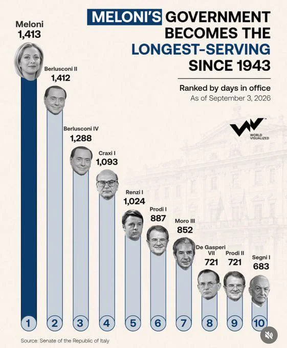
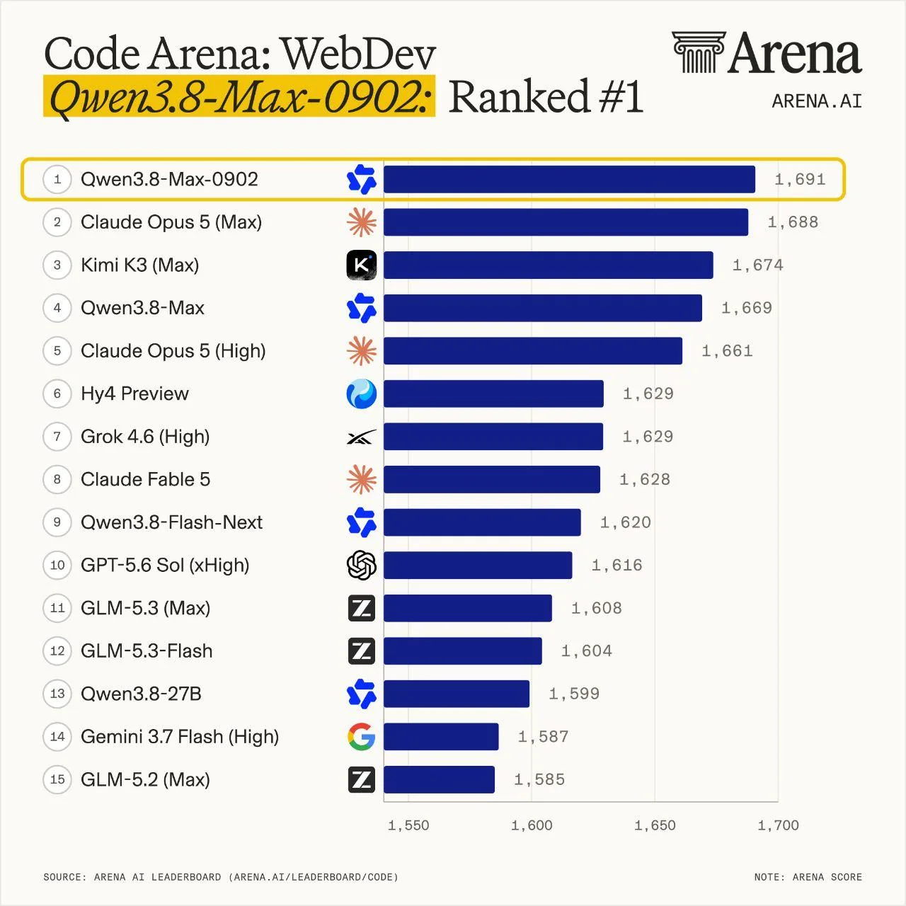
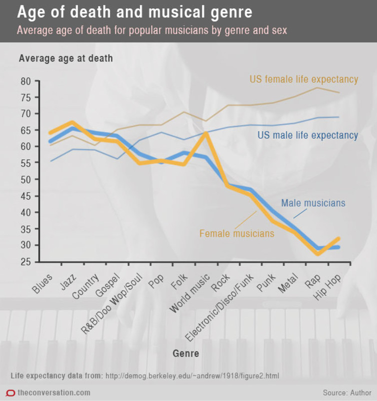

# Image 1
Ce graphique est trompeur car, malgré une différence minime d'un seul jour, la barre représentant le gouvernement de Meloni est nettement plus grande que celle de Berlusconi II. Dans un graphique rigoureux et équitable à l'échelle, des durées quasi identiques devraient se traduire par des hauteurs visuelles similaires, voire égales.
Pour corriger ce défaut, il est impératif d'ajuster la taille des barres (ou des colonnes) de manière strictement proportionnelle aux données réelles, et non de les manipuler pour servir la communication politique.

# Image 2
Ce graphique présente le même type de défaut que le précédent, malgré des écarts de données minimes, la représentation visuelle met en avant des différences disproportionnées qui ne reflètent pas la réalité.
Pour l'améliorer, il est indispensable de calibrer rigoureusement la taille des barres de manière strictement proportionnelle aux valeurs exactes, plutôt que de laisser des choix de mise en forme parfois influencés par le modèle d'IA concerné amplifier artificiellement des variations mineures et fausser la perception de l'observateur.

# Image 3
Ce graphique représente un gros défaut car il ne prend pas en compte la date de création des genres  musicaux la plupart des artistes hiphop, rap et rock sont encore en vies contrairement a ces seniors. 
Pour l'améliorer il faudrait améliorée la nature du graphique et faire une boxplot et nommer clairement l'axe vertical "Âge moyen au décès des artistes de l'échantillon" au lieu de laisser planer le doute avec un terme comme "espérance de vie".  

